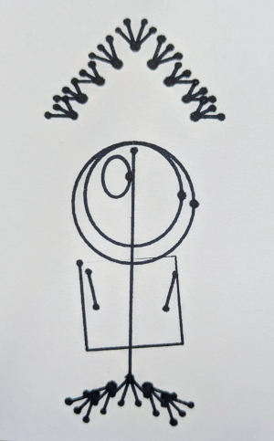

# Hyphae

A relationship maintenance app for neurodiverse adults. Named after the filaments that form fungal networks - threads of connection that sustain life.

Why this project exists, who it's for, and the second purpose it serves as a worked example of agent-native software: [`docs/about.md`](docs/about.md).

---

## Install

You'll need:

- Git
- [Obsidian](https://obsidian.md/) (free)
- A coding agent that can read and write files in folders you point it at. Examples: [Claude Code](https://docs.claude.com/en/docs/claude-code), Cursor's agent mode, or any agent built on a model SDK with file tools. Hyphae is the prompt and runtime config; the coding agent is what executes it.

```bash
# 1. Clone the repo
git clone https://github.com/<owner>/hyphae.git
cd hyphae

# 2. Start your coding agent here. It auto-loads AGENTS.md and walks you
#    through the rest - including asking where you want your vault.
```

On first run, the agent runs an init process: asks you where the vault should live (default `~/Hyphae`), creates the empty folder structure there, and stores the path in `.hyphae-vault` so future sessions know where to operate.

After that, open the vault folder in Obsidian as a vault, install the Dataview community plugin (Settings -> Community plugins -> Browse -> Dataview -> Install -> Enable), and you're ready. The `user-guide.md` at the vault root walks through the rest.

For updates, `git pull` in the cloned repo. The agent runtime updates automatically; your vault data is untouched.

---

## Using it

Once installed, see [`docs/user-guide.md`](docs/user-guide.md) for the home page, prompts you can use with the agent, what a check-in does, layers, goals, and where things live.

Product requirements: [`docs/requirements.md`](docs/requirements.md)

---

## Running the agent

Hyphae needs an LLM. Three honest tiers:

- **Local, accessible (~16GB GPU)** - open-weights models like GPT-OSS-20B via Ollama, LM Studio, or llama.cpp. Nothing leaves your device. Whether this is *enough* model for Hyphae's judgment-shaped work is something we'll find out during development.
- **Local, high capability (~64GB+ unified memory or workstation GPU)** - 70B-class open-weights models. Better judgment, same privacy story.
- **Cloud (hosted)** - Claude, GPT-5, etc. via API. Best capability; vault excerpts are sent to the provider every turn.

Hyphae is model-agnostic. The runtime config in [`agent/`](agent/) is authored to work against the floor model first. Local-first is the design intent; cloud is supported. Tier details: [`docs/deployment-tiers.md`](docs/deployment-tiers.md).

---

## Privacy

The vault is local markdown. It stays on your device unless you sync it yourself.

The privacy story for the agent depends on where you run the model - see [Running the agent](#running-the-agent). With a local model, nothing leaves your machine. With a cloud model, every conversation sends vault excerpts to the provider; check their terms.

No accounts. No analytics. No telemetry from Hyphae itself.

---

## Docs

- [`docs/about.md`](docs/about.md) - why this project exists, who it's for, the agent-native pitch
- [`docs/user-guide.md`](docs/user-guide.md) - how to use Hyphae once installed
- [`docs/agent-native-thesis.md`](docs/agent-native-thesis.md) - the agent-native argument in full, for readers interested in the second purpose of this repo
- [`dev/README.md`](dev/README.md) - for developers: project layout, dev model, sync, migrations

---

## Contributing

Contributions welcome - especially accessibility improvements, translations, coaching content, and neurodiverse UX feedback.

The one test every feature decision should pass: does this make showing up for relationships easier, or harder?

---

## Licence

AGPL-3.0. See [`LICENSE`](LICENSE).

If you want to use Hyphae in a commercial product or service without the AGPL's source-sharing obligations, contact the project owner to discuss commercial licensing.
